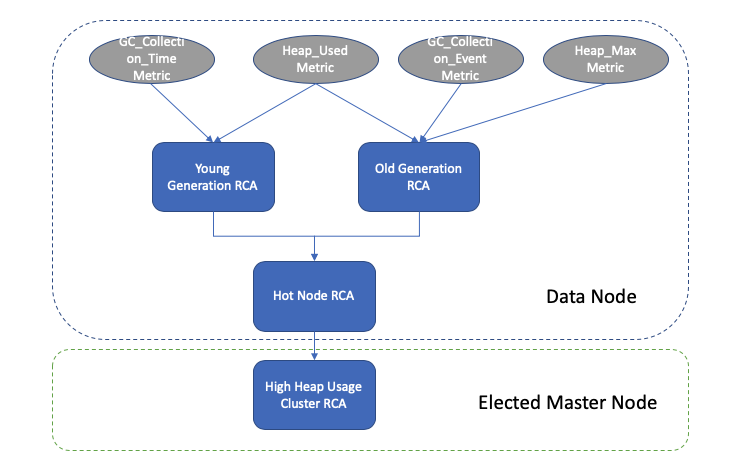

## RCA for JVM heap usage
### Overview
While most of the AES clusters run stably under reasonable JVM heap pressure, we still find quite a few clusters which experience constantly high heap pressure. So we leverage the RCA framework and create two types of RCAs to look deeply into the cluster nodes and provide additional information for us to investigate why the heap usage is high and who are the top consumers of it.

### Old Generation RCA
We built the Old Generation RCA to monitor the old gen usage on data nodes and provides detailed summary in case it is unhealthy. This RCA subscribes three metrics :the current old gen usage(Heap_Used), the maximum heap size (Heap_Max) and GC events count during the last time interval(GC_Collection_Event). The algorithm is sliding window based and whenever the RCA receives metric flow units from those metrics, it pushes the heap usage and full GC count into the sliding window. A non-zero full GC count indicates that there is at least one full GC has just occurred during the last time interval. So the RCA will retrieve the minimum old gen usage from the sliding window and compare it with the threshold.  
  
There are some long-lived objects that can't be garbage collected by full GC and will remain in old gen after full GC and that is why we are interested in the minimum size of old gen after full GC. We set the threshold to be 65% of the entire heap size and the node will be marked as unhealthy if the minimal old gen is constantly above that. To get rid of false positive from sampling, we keep the sliding window big enough to keep at least a couple of such minimum samples and hope that the min old gen we get from the sliding window is close enough to the ground truth.  
  
In the case where the old gen usage is identified as unhealthy, the old gen RCA will generate a summary and pass it to downstream RCA nodes. The summary will also be persisted in SQLite.  
  
Summary generated by Old Generation RCA:

### Young Generation RCA
The young gen RCA subscribes two different metrics : Heap_Usage and GC_Collection_Time. This RCA uses Heap_Usage metric to measure the old gen increase during each time interval which is equivalent to the amount of heap that is promoted from young gen to old gen. The GC_Collection_Time metric on the other hand provides information such as the time spend on minor GC during the last time interval. If the promotion rate is high for a period of time and the JVM spend a significant fraction of of its time running o GC pause, then the young gen in JVM is clearly unhealthy.  
  
We implement this using slide window to calculate the average promotion rate / GC pause and a summary will be generated and persisted in case the RCA found it unhealthy.  
  
Summary generated by Young Generation RCA:

### Hot Node RCA
Hot node RCA is a node level RCA that subscribes a variety of resource type RCAs (i.e. young gen RCA, old gen RCA, cpu usage RCA). It aggregates summaries received from flow units emitted by unhealthy upstream RCA nodes and attaches node level information (data node ip address / node id) to create a flow unit for downstream.  
  
Summary generated by Hot Node RCA:

### Hot Cluster RCA
Hot cluster RCA is a cluster level RCA which runs on elected master node only. It subscribes hot node RCA and leverages the gRPC network layer to fetch flow units from remote data nodes. The RCA maintains a cache to keep track of the last three flow units for each data node and whenever we find all three consecutive flow units are unhealthy, we marked the entire cluster as unhealthy. The cache is configured to evict data node entry that fails to send out flow unit to master in the last 10 minutes so that we don’t keep track of data nodes that already becomes offline.  
  
Summary generated by Hot Cluster RCA:

